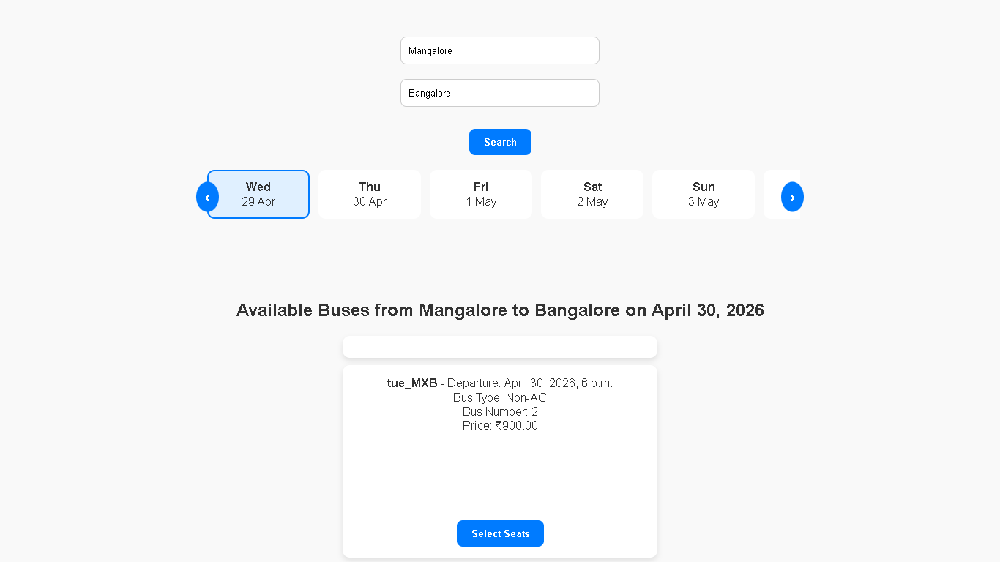
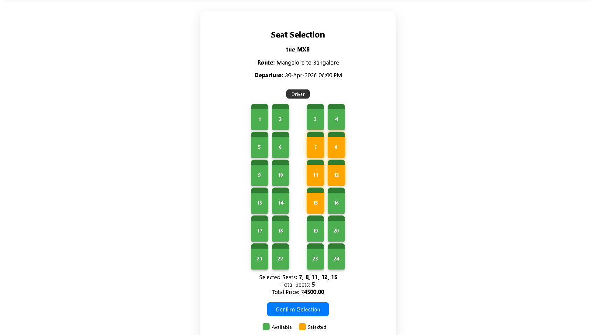
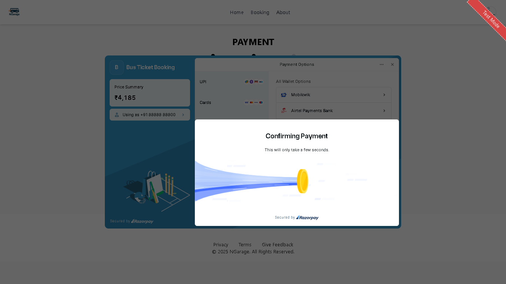
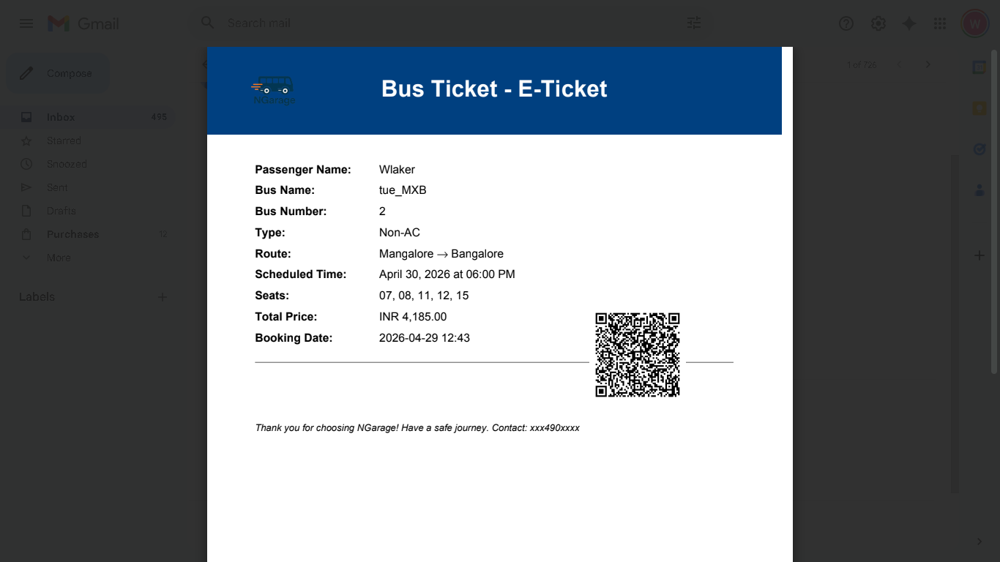

# 🚌 Bus Ticket Booking System (Django)

## 📌 Overview

A full-stack web application that allows users to search routes, select seats from a realistic bus layout, and book tickets with secure payment integration. The system supports dynamic pricing, schedule-based booking, and automated ticket generation.

---

## 🚀 Live Demo

👉 [live-demo-link](https://bus-ticket-booking-pqjs.onrender.com/)

---

## ⚠️ Important Demo Instructions

To properly test the system:

- 📅 Select Date: **April 30** or **May 4**
- 🛣️ Route: **Mangalore → Bangalore ONLY**

---

<!-- ## 🎬 Demo Video

<!-- Option A: Drag and drop your .mp4 file directly into this README on GitHub — it will embed as an inline video player automatically -->

<!-- Option B: YouTube — replace YOUR_VIDEO_ID with your actual video ID -->
<!-- [](https://www.youtube.com/watch?v=YOUR_VIDEO_ID)

-->

## 📸 Screenshots

| Search & Routes | Seat Selection |
|:---:|:---:|
|  |  |

| Payment | PDF Ticket |
|:---:|:---:|
|  |  |


---

## ✨ Features

### 🎟️ Booking System
- Dynamic seat selection (49-seat real bus layout)
- Live seat availability tracking
- Schedule-based booking system

### 💳 Payments
- Razorpay integration for online payments
- Cash on Delivery (COD) option

### 📩 Ticket System
- Email confirmation after booking
- PDF ticket generation and download

### 👤 User Dashboard
- View booking history
- Cancel tickets
- Manage user profile

### 🧑‍💼 Admin Panel
- Manage buses, routes, and schedules
- Dynamic pricing (AC / Non-AC)
- Discount management system

---

## 🏗️ Tech Stack

- **Backend:** Python, Django
- **Frontend:** HTML, CSS, JavaScript
- **Database:** SQLite 
- **Payments:** Razorpay
- **Email:** SMTP / Brevo 

---

## ⚙️ Installation & Setup

```bash
# Clone the repository
git clone https://github.com/Prithvi0fficial/bus_ticket_booking.git

# Navigate to project folder
cd bus_ticket_booking

# Install dependencies
pip install -r requirements.txt

# Apply migrations
python manage.py migrate

# Run development server
python manage.py runserver
```

Open your browser at **http://127.0.0.1:8000**

---

## 🤝 Contributing

Pull requests are welcome. For major changes, please open an issue first.

---

